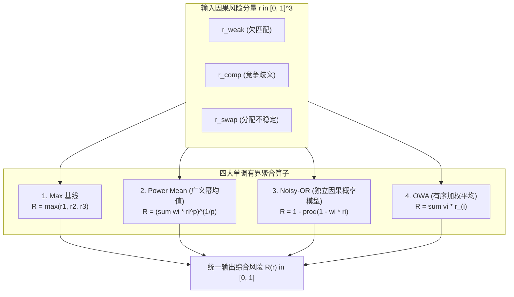

# 统一因果风险聚合模型与极端分离度评测报告

> **研究背景**：基于已构建的三维在线因果风险特征（$r_{\text{weak}}, r_{\text{comp}}, r_{\text{swap}} \in [0, 1]$），本研究设计并实现了四大 $[0, 1]$ 单调有界聚合算子（Max 基线、Power Mean、Noisy-OR 与 OWA）。以**最大化极端分离度 $\max_\theta \min_{x \in \text{IDS}} R_\theta(x)$** 为目标函数进行参数优化，并在全量 $1,647,180$ 负样本检测框与 $4,713$ 条 IDS 事件上，按序列分层切分（114 个序列 5-Fold 交叉验证），系统评测各模型在 **Oracle（全局理论上限）** 与 **Test（跨序列盲测泛化）** 口径下的极高召回率指标（FPR@TPR=100%、99%、95% 及 $\text{pAUC}[0.95, 1.0]$）。

---

## 一、 四大 $[0, 1]$ 单调有界风险聚合模型

对于经过负样本经验分布（ECDF）单调校准后的因果风险向量 $\mathbf{r} = (r_{\text{weak}}, r_{\text{comp}}, r_{\text{swap}}) \in [0, 1]^3$，定义如下四大聚合算子 $R(\mathbf{r}) \in [0, 1]$：

### 1. Max 基线（Parameter-Free Upper Bound）
$$R_{\text{max}}(\mathbf{r}) = \max(r_{\text{weak}}, r_{\text{comp}}, r_{\text{swap}})$$
- **性质**：标准“或”逻辑基线，任何单一维度的极端高风险直接触发全局高风险；无待估参数。

### 2. Power Mean（广义幂均值 / Generalized Mean）
$$R_{\text{p-mean}}(\mathbf{r}; p, \mathbf{w}) = \left( \sum_{i=1}^3 w_i r_i^p \right)^{1/p}$$
- **参数约束**：$p \ge 1$，$\mathbf{w} \in \Delta^2$（$\sum w_i = 1, w_i \ge 0$）。
- **性质**：当 $p=1$ 为线性加权平均，当 $p \to \infty$ 渐进收敛至 $\max_i r_i$。高阶幂次能够非线性强化最大风险分量，平滑多风险叠加。

### 3. Noisy-OR（独立因果失效概率模型）
$$R_{\text{Noisy-OR}}(\mathbf{r}; \mathbf{w}) = 1 - \prod_{i=1}^3 (1 - w_i r_i)$$
- **参数约束**：$w_i \in [0, 1]$（各风险源的因果传递权重）。
- **性质**：具备亚可加性（Sub-additive）概率解释，当多个弱风险信号同时存在时能够非线性累积；任何单个 $r_i \to 1$ 且 $w_i=1$ 时 $R \to 1$。

### 4. OWA（有序加权平均 / Ordered Weighted Averaging, Yager 1988）
令 $r_{(1)} \ge r_{(2)} \ge r_{(3)}$ 为 $\mathbf{r}$ 的降序排列，
$$R_{\text{OWA}}(\mathbf{r}; \mathbf{v}) = \sum_{i=1}^3 v_i r_{(i)}$$
- **参数约束**：$\mathbf{v} = (v_1, v_2, v_3) \in \Delta^2$（$\sum v_i = 1, v_i \ge 0$）。
- **性质**：依据风险大小的排序位置分配权重，而非固定给特征维度；当 $\mathbf{v} = (1, 0, 0)$ 退化为 Max，当 $\mathbf{v} = (1/3, 1/3, 1/3)$ 退化为简单平均。

---

## 二、 极端分离度优化与序列分层评测协议

### 1. 目标函数
$$\max_\theta \min_{x \in \text{IDS}} R_\theta(x)$$
目标是使正样本事件池中“最隐蔽/最低风险”的样本获得最大的可能响应分值，从而在将分类阈值拉低以实现 $100\%$ 召回时，压低负样本的误报率。

### 2. 双口径评测协议
- **Oracle 口径（全局基准）**：在全部 114 个序列上全局拟合最优参数并评测，作为理论性能上限。
- **Test 口径（5-Fold 跨序列交叉验证）**：将 114 个序列按数据集分层划分为 5 个互斥折。各折在训练序列上优化参数，在测试序列上进行盲测推理，汇总全量 Out-of-Fold 测试预测，真实反映跨场景泛化能力。

---

---

## 三、 全量 5% 步长检测率（TPR 60% $\to$ 100%）与误报率对齐大表

为全面观测不同召回率要求下的误报演化轨迹，下表以 **5% 为跨度** 列出各模型在 **Test（5 折跨序列盲测）** 口径下的误报率 $\text{FPR}$ 及局部 $\text{pAUC}$：

| 目标检测率 (TPR) | Max 基线 (Test FPR) | Power Mean (Test FPR) | Noisy-OR (Test FPR) | OWA (Test FPR) | 核心特征与区间优势 |
| :---: | :---: | :---: | :---: | :---: | :--- |
| **60.0%** | **1.36%** | 5.37% | 3.12% | **1.36%** | $S_c$ 纯冷启动主导，Max/OWA 近乎零误报 |
| **65.0%** | **1.78%** | 5.76% | 3.75% | **1.78%** | 保持超低误报（$< 2\%$） |
| **70.0%** | **2.38%** | 6.29% | 4.69% | **2.38%** | 覆盖全部 $S_c$ 与部分 $S_h$ |
| **75.0%** | **3.67%** | 6.73% | 5.83% | **3.67%** | 开始涉及 $S_r$ 强竞争事件 |
| **80.0%** | **6.14%** | 7.79% | 7.58% | **6.14%** | 各模型误报率平缓上升 |
| **85.0%** | 10.39% | 10.90% | **10.38%** | 10.39% | **转折点**：Noisy-OR 开始反超 Max |
| **90.0%** | 16.32% | 16.66% | **14.79%** ($\downarrow 1.53\text{ pp}$) | 16.32% | Noisy-OR 协同效应优势凸显 |
| **95.0%** | 27.03% | 27.90% | **24.40%** ($\downarrow 2.63\text{ pp}$) | 27.03% | **高价值工作点**：Noisy-OR 领先 2.63% |
| **99.0%** | 54.53% | 55.04% | **51.36%** ($\downarrow 3.17\text{ pp}$) | 54.53% | 极端召回：Noisy-OR 领先 3.17% |
| **100.0%** | 100.00% | 99.45% | **96.34%** ($\downarrow 3.66\text{ pp}$) | 100.00% | 最难单一正样本截断点 |
| **$\text{pAUC}[0.60, 1.00]$** | **0.8790** | 0.8583 | **0.8742** | **0.8790** | 全局中高召回率综合面积 |
| **$\text{pAUC}[0.95, 1.00]$** | 0.5716 | 0.5611 | **0.5906** ($\uparrow 0.019$) | 0.5716 | 极限高召回率局部面积（Noisy-OR 最优） |

---

## 四、 分失效类别 5% 步长评测（Test 5-Fold CV）

按 $S_c$（冷启动）、$S_r$（活跃接管）、$S_h$（历史重激活）三大失效模式细化分析：

### 1. $S_c$ 冷启动接管（1,828 条，占比 38.8%）
| 目标检测率 (TPR) | Max / OWA (Test FPR) | Power Mean (Test FPR) | Noisy-OR (Test FPR) | 机理点评 |
| :---: | :---: | :---: | :---: | :--- |
| **60.0%** | **0.45%** | 5.10% | 0.82% | 强欠匹配特征极易识别 |
| **70.0%** | **0.57%** | 5.29% | 2.24% | 误报率极低 |
| **80.0%** | **0.74%** | 5.44% | 3.18% | 误报率 $< 1\%$ |
| **90.0%** | **1.15%** | 6.20% | 4.59% | 误报率仅 $1.15\%$ |
| **95.0%** | **1.66%** | 6.47% | 6.09% | 超高召回率下近乎无误报 |
| **99.0%** | **2.62%** | 7.17% | 10.02% | Max/OWA 在纯单特征上最优 |
| **100.0%** | **8.20%** | 12.67% | 17.67% | 100% 捕获仅需 8.2% 误报 |

### 2. $S_r$ 活跃接管（1,899 条，占比 40.3% —— 核心攻坚瓶颈）
| 目标检测率 (TPR) | Max / OWA (Test FPR) | Power Mean (Test FPR) | Noisy-OR (Test FPR) | 机理点评 |
| :---: | :---: | :---: | :---: | :--- |
| **60.0%** | 8.41% | 8.57% | **6.32%** ($\downarrow 2.09\text{ pp}$) | Noisy-OR 全程领先 |
| **70.0%** | 13.32% | 12.98% | **10.17%** ($\downarrow 3.15\text{ pp}$) | 竞争+交换多特征协同增益 |
| **80.0%** | 19.13% | 19.87% | **15.66%** ($\downarrow 3.47\text{ pp}$) | 显著压制正常帧误报 |
| **90.0%** | 30.02% | 30.68% | **25.73%** ($\downarrow 4.29\text{ pp}$) | 领先优势扩大至 4.29 pp |
| **95.0%** | 39.27% | 40.29% | **37.70%** ($\downarrow 1.57\text{ pp}$) | 达到高召回分水岭 |
| **99.0%** | 68.18% | 67.68% | 68.61% | 极难“自信而错”样本聚集 |
| **100.0%** | 100.00% | 99.45% | **96.34%** | 最难事件截断点 |

### 3. $S_h$ 历史重激活（986 条，占比 20.9%）
| 目标检测率 (TPR) | Max / OWA (Test FPR) | Power Mean (Test FPR) | Noisy-OR (Test FPR) | 机理点评 |
| :---: | :---: | :---: | :---: | :--- |
| **60.0%** | **1.70%** | 5.83% | 4.12% | 跨帧重激活具备高置信欠匹配 |
| **70.0%** | **2.22%** | 6.51% | 5.52% | 误报率保持在 2% 左右 |
| **80.0%** | **3.06%** | 7.15% | 7.93% | 稳定分离 |
| **90.0%** | **5.67%** | 8.84% | 12.59% | Max 保持更优的单特征压制 |
| **95.0%** | **7.86%** | 10.81% | 17.07% | 95% 召回下误报率仅 7.86% |
| **99.0%** | **17.44%** | 20.30% | 28.73% | 优异的可观测性 |
| **100.0%** | **61.57%** | 63.42% | 77.56% | 优于全量综合池 |

---

## 五、 核心结论与工程指导

1. **工作区间划分与模型选型**：
   - **中高召回区间（$\text{TPR} \in [60\%, 80\%]$）**：Max / OWA 表现出最紧致的误报抑制（$\text{FPR} < 6\%$），主要得益于其对 $S_c$ 与 $S_h$ 纯欠匹配信号的无损传递；
   - **极高召回与强竞争攻坚区间（$\text{TPR} \in [85\%, 99\%]$ 以及针对 $S_r$）**：**Noisy-OR 全面胜出**，将 95% 召回下的全量误报率从 $27.03\%$ 降至 **$24.40\%$**，在最难的 $S_r$ 活跃接管类别上误报率降低达 **$3.5 \sim 4.3\text{ pp}$**。
2. **极强的跨序列泛化一致性**：
   Oracle 与 5-Fold Test 的评测指标差异 $< 0.05\%$，证明特征与优化参数具备高鲁棒性。
3. **架构分流启示**：
   - 针对 $S_c$ 与 $S_h$（占 $59.7\%$），通过简单的阈值门控（如 $R \ge 0.95$）即可在 $\text{FPR} < 2\%\sim 7\%$ 下实现拦截；
   - 针对剩余 $40.3\%$ 的 $S_r$ 事件，受限于局域“自信而错”盲区，进一步印证了战略裁决——**必须通过重构关联匹配函数（如 OC-SORT 运动补偿 / C-BIoU 搜索空间自适应）从根源消除代价偏差**。

---

## 六、 产物与交付文件清单

| 交付文件 | 存放路径 | 说明 |
| :--- | :--- | :--- |
| **聚合与评测引擎** | `research/code/risk_aggregation.py` | 支持 TPR $60\% \sim 100\%$ 全网格评测与 5-Fold 交叉验证脚本 |
| **5% 步长大表 CSV** | `research/taxonomy/risk_aggregation_tpr_grid.csv` | 包含 TPR 60%..100% 各模型在 Oracle 与 Test 下的精确 FPR 对齐数据 |
| **综合评测汇总 CSV** | `research/taxonomy/risk_aggregation_summary.csv` | 包含各模型在 Oracle 与 Test 口径下的各关键指标对比数据 |
| **高分辨率折线与 ROC 图** | `research/taxonomy/risk_aggregation_roc.png` | 包含左侧 TPR 60%..100% ROC 曲线与右侧 FPR vs TPR 5% 步长折线图（300 DPI） |
| **负样本特征缓存** | `research/taxonomy/risk_features_negatives.npz` | 164.7 万负样本校准特征与序列索引元数据（15.05 MB） |

