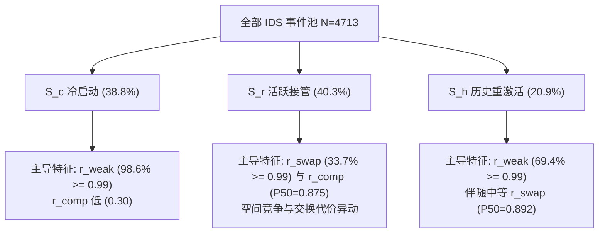

# 统一无门控因果风险特征抽取与 ECDF 经验分布校准分析报告

> **目标**：彻底移除 `top1>=0.2 and top2>=0.2` 的前置资格门控，为全量负样本检测框（C 组，约 165 万框）与全量 4,713 条 IDS switch 事件统一提取 $r_{\text{weak}}$（欠匹配风险）、$r_{\text{comp}}$（竞争歧义）与 $r_{\text{swap}}$（分配不稳定）三个严格因果的物理特征，并基于负样本经验累积分布函数（ECDF）单调校准映射为 $[0, 1]$ 风险分量，交付零 NaN 缺失的统一风险矩阵 $[N_{\text{samples}}, 3]$。

---

## 一、 背景与特征物理建模

在早期的门控与诊断体系中，特征计算依赖于前置资格条件 $E = (top_1 \ge 0.2) \land (top_2 \ge 0.2)$，导致孤立目标、单轨迹场景及冷启动事件（$S_c$）在特征提取层面出现“结构性盲区”或产生大量的 NaN。

本工作彻底移除了这一门控，对所有检测框与事件统一建立如下**严格在线因果（仅依赖当前检测与 $F-1$ 预测框）**的物理特征：

| 风险维度 | 符号 | 物理机理 | 原始特征计算式 $f$ | 边界与无框缺省定义 |
| :--- | :---: | :--- | :--- | :--- |
| **欠匹配风险** | $r_{\text{weak}}$ | 当前检测与所有前序轨迹的重叠度极低或无匹配 | $f_{\text{weak}} = 1.0 - top_1$ | 当帧无活跃轨迹时 $top_1=0 \implies f_{\text{weak}}=1.0$；值域严格 $[0, 1]$ |
| **竞争歧义风险** | $r_{\text{comp}}$ | 存在次优候选轨迹强力竞争同一检测框 | $f_{\text{comp}} = top_2$ | 轨迹数 $m < 2$（无次优候选）时赋 $f_{\text{comp}}=0.0$；值域严格 $[0, 1]$ |
| **分配不稳定性** | $r_{\text{swap}}$ | 局部 2×2 交换分配代价差，对调后成本更低表明当前关联极其脆弱 | $f_{\text{swap}} = \Delta C_{\text{swap}}$ $(c_{12}+c_{21}) - (c_{11}+c_{22})$ | $m < 2$ 或 $n < 2$ 或无 $D_2$ 时赋安全基准值 $f_{\text{swap}}=-2.0$ |

> **事件帧缺省处理**：若事件接收方在事件发生帧无检测输出（`no_box == 1`），统一赋予标准因果向量 $[f_{\text{weak}}=1.0, f_{\text{comp}}=0.0, f_{\text{swap}}=-2.0]$，确保全量数据零 NaN。

---

## 二、 负样本经验分布（ECDF）单调校准

基于三数据集非事件帧（C 组）全量检测框构成的负样本集合 $X_{\text{neg}} \in \mathbb{R}^{1,647,180 \times 3}$，对各维度独立建立单调非递减的经验分布校准函数：

$$\hat{F}_{\text{neg}, j}(x) = \frac{1}{N_{\text{neg}}} \sum_{i=1}^{N_{\text{neg}}} \mathbb{I}(X_{\text{neg}, i, j} \le x)$$

校准后的风险分量 $r_j = \hat{F}_{\text{neg}, j}(f_j)$ 具备以下优良性质：
1. **严格区间与零 NaN 保障**：$r_j \in [0.0, 1.0]$，完全消除数值奇异点。
2. **严格的误报率（FPR）对齐**：负样本在 $r_j$ 上服从标准均匀分布 $\text{Uniform}(0, 1)$。设定阈值 $r_j \ge 0.99$ 严格等价于正常帧误报率 $\text{FPR} \le 1\%$（$r_j \ge 0.98 \iff \text{FPR} \le 2\%$）。

### 负样本经验分布统计（$N_{\text{neg}} = 1,647,180$）

| 原始特征 | Min | P10 | P50 (中位数) | P90 | P99 | Max |
| :--- | :---: | :---: | :---: | :---: | :---: | :---: |
| **$f_{\text{weak}}$ ($1 - top_1$)** | 0.0000 | 0.0137 | **0.0361** | 0.1032 | 0.3188 | 1.0000 |
| **$f_{\text{comp}}$ ($top_2$)** | 0.0000 | 0.0000 | **0.1869** | 0.4747 | 0.6497 | 0.9376 |
| **$f_{\text{swap}}$ ($\Delta C_{\text{swap}}$)** | -2.0000 | -1.9112 | **-1.5274** | -0.9402 | -0.5586 | 0.9240 |

> **分析**：正常帧中 90% 的检测框与历史轨迹重叠度超过 0.8968（$f_{\text{weak}} \le 0.1032$），且 99% 的检测框交换代价 $\Delta C_{\text{swap}} \le -0.5586$，表现出高度的稳定性和确定性。

---

## 三、 全量 IDS 事件校准风险矩阵分析

在全量 4,713 条 IDS 事件上的校准风险矩阵 $[4713, 3]$ 统计如下：

### 1. 全局事件风险分布对比

| 风险特征 | Mean | Std | P10 | P50 (中位) | P90 | 高风险占比 ($r \ge 0.99$, 即 $\text{FPR} \le 1\%$) |
| :--- | :---: | :---: | :---: | :---: | :---: | :---: |
| **$r_{\text{weak}}$（欠匹配风险）** | **0.9291** | 0.1607 | 0.7673 | **0.9944** | 1.0000 | **59.86%** |
| **$r_{\text{comp}}$（竞争歧义风险）** | **0.5453** | 0.3058 | 0.2264 | **0.4925** | 0.9592 | **4.33%** |
| **$r_{\text{swap}}$（分配不稳定风险）** | **0.8713** | 0.1594 | 0.6721 | **0.9134** | 0.9979 | **19.46%** |

---

### 2. 三大失效模式的机理正交解耦（Class-wise Breakdown）

三维因果风险特征在三类互斥失效模式上呈现出极具解释性的机理分离：

| 失效模式 | 样本数与占比 | $r_{\text{weak}}$ 均值 (P50) | $r_{\text{comp}}$ 均值 (P50) | $r_{\text{swap}}$ 均值 (P50) | 核心主导风险 (FPR $\le 1\%$ 捕获率) |
| :--- | :---: | :---: | :---: | :---: | :--- |
| **$S_c$（冷启动接管）** | 1,828 (38.8%) | **0.9983 (1.0000)** | 0.3040 (0.2264) | 0.8917 (0.9058) | **$r_{\text{weak}} \ge 0.99$ 达到 98.63%** （几乎完全由欠匹配主导） |
| **$S_r$（活跃接管）** | 1,899 (40.3%) | 0.8321 (0.9308) | **0.7940 (0.8749)** | **0.8756 (0.9505)** | **$r_{\text{swap}} \ge 0.99$ 达 33.70%**，$r_{\text{comp}}$ 中位 0.8749 （由空间竞争与 2×2 交换不稳定性主导） |
| **$S_h$（历史重新激活）** | 986 (20.9%) | **0.9874 (0.9943)** | 0.5139 (0.4696) | 0.8252 (0.8923) | **$r_{\text{weak}} \ge 0.99$ 达 69.37%** （跨帧丢失后重激活呈现较高欠匹配风险） |

---

## 四、 核心交付物与校验

所有交付文件均已生成并放置于 `research/taxonomy/`：

1. **核心风险张量**：`research/taxonomy/risk_features_events.npy`
   - Shape: `(4713, 3)`，Dtype: `float64`
   - NaN 数量：**0**
   - 取值范围：**$[0.001031, 1.000000] \subset [0, 1]$**
2. **完整元数据压缩包**：`research/taxonomy/risk_features_events.npz`
   - 包含：`risk_matrix`, `raw_matrix`, `dataset`, `seq`, `frame`, `class_labels`, `track_id`, `gt_id_new`, `no_box`, `feature_names`, `n_neg_samples`
3. **人类可读事件表**：`research/taxonomy/risk_features_events.csv`
   - 4,714 行（1 表头 + 4,713 事件），包含原始特征与校准风险评分。
4. **冻结经验分布校准模型**：`research/taxonomy/risk_ecdf_calibrator.npz`
   - 保存 164.7 万负样本的有序断点及 1001 级分位数映射表，支持极速在线/离线推断。

### Sanity 断言验证记录
- ✅ `assert risk_event_matrix.shape == (4713, 3)`
- ✅ `assert np.isnan(risk_event_matrix).sum() == 0`
- ✅ `assert (risk_event_matrix >= 0.0).all() and (risk_event_matrix <= 1.0).all()`
- ✅ 事件计数严格对齐：$S_c = 1,828$, $S_r = 1,899$, $S_h = 986$，总数 4,713。
